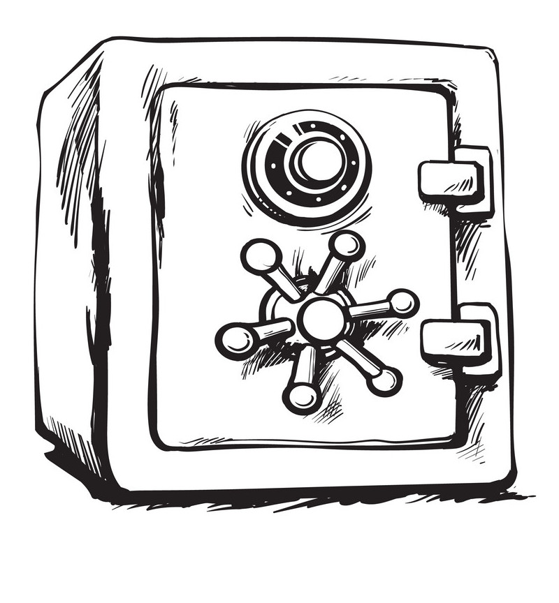

# MutexSafe
<h3 align="center">Help use mutex effectively | With PHP7</h3>
<p align="center">
   
</p>
[](//packagist.org/packages/phpunit/phpunit) [](//packagist.org/packages/phpunit/phpunit) [](//packagist.org/packages/phpunit/phpunit) [](//packagist.org/packages/phpunit/phpunit)
- This library will help you use mutex more effectively.
- Different mutex for different components are presented.
- In addition, you can add your own lockers and use within the library.

## How to use

```php
$customHandler = new \CustomHandler(/* some parameters */);

// You can send the handler directly to the constructor
$factory = new \Foxtech\Competitor($customHandler);

/* OR */

// via the setHandler method
$factory = new \Foxtech\Competitor();
$factory->setHandler($customHandler);

$timeout = 50;//seconds
$factory->getMutex('mutex_name')->acquire($timeout /* default timeout - 30 seconds */);

// some code

$factory->getMutex('mutex_name')->release();
```

------------
> You can also write your own mutex to a custom handler and use within our library.(**Important**: Your mutex must implement our [interface](https://github.com/foxtech6/mutex-locker/blob/master/src/foxtech/MutexInterface.php))

```php
$yourCustomHandler = new YourCustomHandler();

$factory = new \Foxtech\Competitor();
$factory->push(YourCustomHandler::class, YourMutex::class);
$factory->setHandler($yourCustomHandler);

$factory->getMutex('mutex_name')->acquire();

// some code

$factory->getMutex('mutex_name')->release();
```

------------
**PDO Handler**

```php
$pdo = new \PDO('mysql:host=localhost;dbname=test', 'root', 'toor');

$factory = new \Foxtech\Competitor($pdo);

$factory->getMutex('mutex_name')->acquire();

// some code

$factory->getMutex('mutex_name')->release();
```

License
----
[MIT](https://github.com/foxtech6/mutex-locker/blob/master/LICENSE)
